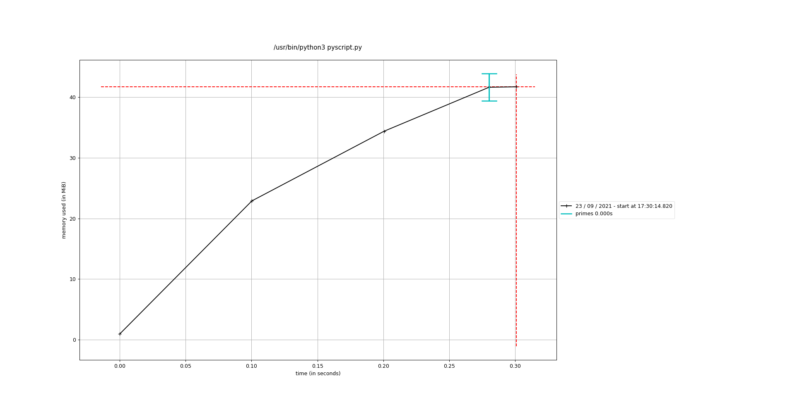

<!-- PROJECT LOGO -->
<br />
<p align="center">
    
    <p  align="center" style="font-size:0.75em;">Icon made by <a href="https://www.freepik.com" title="Freepik">Freepik</a> from <a href="https://www.flaticon.com/" title="Flaticon">www.flaticon.com</a></p>
    <h1 align="center">Tips to speed up python codes</h1>
    <h2 align="center">Python Workshop - Leeds Institute for Data Analytics (LIDA)</h2>
</p>

## Disclaimer

> This repository is under construction. 
> The workshop will be held at October 2021.

## General solution

> To speed up any Python code four steps can be followed:

1. Before moving on to more advanced techniques, it is recommended to review the code, following a series of good practices. Some tips from these best practices (which lead to better code performance) are listed in the [General tips](#general-tips) session.
2. Once you have ensured that your code is *well written*, it is recommended to profile your code (see [CPU profiling](#cpu-profiling) and [Memory profiling](#memory-profiling) sessions).
3. It is possible to translate the Python function to an optimized code (see [Native-speed code](#native-speed-code) session).
4. Finally, it is possible to separate the running process in several processes to be run in parallel (see [Multiprocessing](#multiprocessing)).

---

## General tips

Before moving on to more advanced techniques, it is necessary to ensure that the code is written in the best possible way. Below, some practices considered ideal will be presented.

### Python version

> Every release is more optimized.

The latest version should have the best performance, so make sure you always use the latest version. At least choose Python 3 over Python 2.

### Data structure

> Using the most appropriate data structure is critical to speed up the code.

Python has some built-in data structures (namely: list, tuple, set, and dictionary). It is also possible to use additional data structures by importing modules (like [NumPy array](https://numpy.org/doc/stable/reference/generated/numpy.array.html) and [pandas DataFrame](https://pandas.pydata.org/docs/reference/api/pandas.DataFrame.html)).

One of the most common mistakes is using the **list** structure for all cases. For example, if your list has elements of a single type (like real numbers), you might consider using a NumPy array to optimise the code.

### Assign variables

> Avoid assign variables inside loops.

Variables assigned within loops are recreated whenever the loop is iterated.

> Multiple assignments

If there is more than one variable to assign, you can perform a multiple assignment. The code:

```python
x, y, z = 1, 2, 3
```

is more efficient than

```python
x = 1
y = 2
z = 3
```

### Library function and dot operation

> Library functions are designed to be as efficient as possible.

Instead of writing your own functions, whenever possible use functions from existing libraries. Also, when using a library function, avoid using the dot operation. The following code:

```python
from math import sqrt

x = sqrt(4)
```

is more efficient than the code with dot operation:

```python
import math

x = math.sqrt(4)
```

that is more efficient than the code with a homemade function:

```python
x = 4 ** 0.5
```

### List comprehension

> List comprehension is a very concise syntax to create a new list

Create lists using *list comprehension* whenever possible. List comprehension can be used over:

- loops
- lambda function
- map()
- filter()
- reduce()

For example, to create a list of even numbers, you can change the following code:

```python
x = []
for i in range(100):
    if i%2 == 0:
      x.append(i)
```

for a list comprehension:

```python
x = [i for i in range(100) if i%2 == 0]
```

### If-else ladder

> Put high probability if-statements first!

Putting low probability if-statements early will make your code perform more operations than necessary.

---

## CPU profiling

Once the code is performing the desired task and has been written following best practices, the next step  is profiling the code to find possible bottlenecks. By profiling your code you can identify what part demands more execution time and focus your attention in this part.

There are different approaches to profiling the code, here I will suggest one that is easy to install/use, while producing meaningful results: the `line_profiler` module. It can be installed through command prompt typing either:

- `pip install line_profiler`
- `conda install line_profiler` (for Anaconda Python)

To use the `line_profiler` module it is necessary to follow two steps:

1. add a `@profile` decorator
2. command prompt: `kernprof -l -v file.py`

```python
@profile
def primes(n):
    if n==2:
        return [2]
    elif n<2:
        return []

    s=list(range(3,n+1,2))
    mroot = n ** 0.5
    half=(n+1)//2-1
    i=0
    m=3

    while m <= mroot:
        if s[i]:
            j=(m*m-3)//2
            s[j]=0
            while j<half:
                s[j]=0
                j+=m
        i=i+1
        m=2*i+3
    return [2]+[x for x in s if x]

primes(100)
```

Then go to the command prompt and type:

```bash
kernprof -l -v pyscript.py
```

The output will be

```bash
Wrote profile results to pyscript.py.lprof
Timer unit: 1e-06 s

Total time: 4.9e-05 s
File: pyscript.py
Function: primes at line 1

Line #      Hits         Time  Per Hit   % Time  Line Contents
==============================================================
     1                                           @profile
     2                                           def primes(n):
     3         1          2.0      2.0      4.1      if n==2:
     4                                                   return [2]
     5         1          0.0      0.0      0.0      elif n<2:
     6                                                   return []
     7                                           
     8         1          2.0      2.0      4.1      s=list(range(3,n+1,2))
     9         1          3.0      3.0      6.1      mroot = n ** 0.5
    10         1          0.0      0.0      0.0      half=(n+1)//2-1
    11         1          0.0      0.0      0.0      i=0
    12         1          0.0      0.0      0.0      m=3
    13                                           
    14         5          3.0      0.6      6.1      while m <= mroot:
    15         4          2.0      0.5      4.1          if s[i]:
    16         3          1.0      0.3      2.0              j=(m*m-3)//2
    17         3          1.0      0.3      2.0              s[j]=0
    18        31          9.0      0.3     18.4              while j<half:
    19        28          9.0      0.3     18.4                  s[j]=0
    20        28         10.0      0.4     20.4                  j+=m
    21         4          1.0      0.2      2.0          i=i+1
    22         4          1.0      0.2      2.0          m=2*i+3
    23         1          5.0      5.0     10.2      return [2]+[x for x in s if x]

```

According to the `line_profiler` [documentation](https://github.com/rkern/line_profiler), the output headers have the following meaning:

- *Timer unit: conversion factor to seconds.*
- *Line #: The line number in the file.*
- *Hits: The number of times that line was executed.*
- *Time: The total amount of time spent executing the line in the timer's units.*
- *Per Hit: The average amount of time spent executing the line once in the timer's units.*
- *% Time: The percentage of time spent on that line relative to the total amount of recorded time spent in the function.*
- *Line Contents: The actual source code.*
  
Comparing the row values in the `% Time` column it is possible to note some things:

1. the `mroot` variable is consuming a large amount of time for a single line operation.
2. the nested while-statement is consuming most part of the running time: just to create a list of zeros!

From here it is an iterative process. Try to propose *cheaper* solutions for slow code parts identified through profiling, and then rerun `line_profiler`. Compare the results to decide which approach was most effective.

For example, the nested while statement

```python
while j<half:
    s[j]=0
    j+=m
```

could be replaced by a for statement over a vector of zeros

```python
for k in range(j, half, m):
  s[k]=0
```

or could be even further improved using an indexing solution:

```python
k = np.arange(j, half, m)
s[k] = 0
```

---

## Memory profiling

The memory profiling follows an approach similar to the one discussed above. To this task the `memory-profiler` module will be used (see [here](https://pypi.org/project/memory-profiler/) more information). It can be installed through command prompt typing either:

- `pip install memory_profiler`
- `conda install memory_profiler` (for Anaconda Python)

The `memory-profiler` module depends on the `psutil` module that can be installed through command prompt typing either:

- `pip install psutil`
- `conda install psutil` (for Anaconda Python)

To use the `memory_profiler` module it is necessary to follow two steps:

1. add a `@profile` decorator (similar to the `line_profiler` module)
2. command prompt: `python -m memory_profiler file.py`

For the `pyscript.py` file go to the command prompt and type:

```bash
python -m memory_profiler pyscript.py
```

The output will be:

```bash
Line #    Mem usage    Increment  Occurences   Line Contents
============================================================
     1   41.762 MiB   41.762 MiB           1   @profile
     2                                         def primes(n):
     3   41.762 MiB    0.000 MiB           1       if n==2:
     4                                                 return [2]
     5   41.762 MiB    0.000 MiB           1       elif n<2:
     6                                                 return []
     7                                         
     8   41.762 MiB    0.000 MiB           1       s=list(range(3,n+1,2))
     9   41.762 MiB    0.000 MiB           1       mroot = n ** 0.5
    10   41.762 MiB    0.000 MiB           1       half=(n+1)//2-1
    11   41.762 MiB    0.000 MiB           1       i=0
    12   41.762 MiB    0.000 MiB           1       m=3
    13                                         
    14   41.762 MiB    0.000 MiB           5       while m <= mroot:
    15   41.762 MiB    0.000 MiB           4           if s[i]:
    16   41.762 MiB    0.000 MiB           3               j=(m*m-3)//2
    17   41.762 MiB    0.000 MiB           3               s[j]=0
    18   41.762 MiB    0.000 MiB          31               while j<half:
    19   41.762 MiB    0.000 MiB          28                   s[j]=0
    20   41.762 MiB    0.000 MiB          28                   j+=m
    21   41.762 MiB    0.000 MiB           4           i=i+1
    22   41.762 MiB    0.000 MiB           4           m=2*i+3
    23   41.762 MiB    0.000 MiB          52       return [2]+[x for x in s if x]
```

The `memory-profiler` module also has a nice visualization tool that can be used by typing in the command prompt:

```bash
mprof run file.py
```

and then:

```bash
mprof plot
```

For the `pyscript.py` file the output visualization is:



This method is very useful to avoid reaching memory limits.

---
